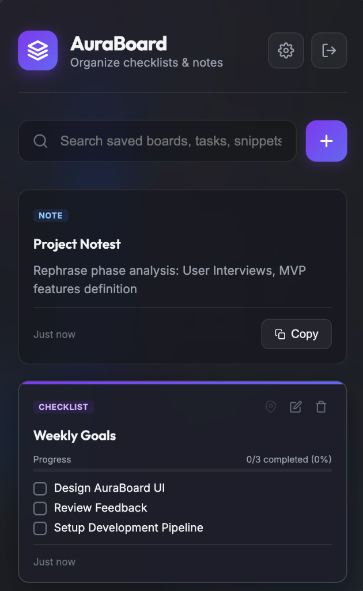

# AuraBoard ⚡

AuraBoard is a beautiful, high-fidelity macOS menu-bar / tray helper application designed for developers and power users who need instant access to checklists and notes. It features a translucent, glassmorphic design, synthesized sound effects, customizable global hotkeys, and smooth window resizing.

[](https://github.com/pushpendrabansal/checklist/releases)



---

## ✨ Features

- 📝 **Unified Note & Checklist Editor**: Switch between rich text notes and structured checklists with a sleek iOS/macOS-style slider toggle.
- 🎚️ **Premium Glassmorphic UI**: Translucent layout, fine borders, responsive scaling, and high-fidelity focus animations that feel native to macOS.
- 📐 **Drag-to-Resize Popup**: Simply grab the resize handler in the bottom-right corner to adjust the popup size. The window dynamically re-centers itself perfectly under the tray icon.
- 🧹 **Smart Checklist Sort**: Checked checklist items automatically animate and move to the bottom, keeping your active items clear and structured.
- 🎵 **Synthesized Sound Effects**: Built-in sound synth triggers subtle, high-quality audio feedback for saves, ticks, list completion, and deletions. (Can be toggled in Preferences).
- ⚡ **Global Toggle Shortcut**: Bring up AuraBoard instantly from anywhere using `Cmd + Option + V` (or custom hotkeys configured in Preferences).
- 🔍 **Real-time Search**: Instant search filtering matching item titles and content as you type.
- 📌 **Priority Pinning**: Pin critical cards to keep them anchored at the top of your feed.

---

## 🚀 Getting Started

### Prerequisites

You will need [Node.js](https://nodejs.org/) (v16+ recommended) installed on your system.

### Installation

1. Clone this repository to your local machine:
   ```bash
   git clone https://github.com/pushpendrabansal/checklist.git
   cd checklist
   ```

2. Install the dependencies:
   ```bash
   npm install
   ```

### Running the App

Start the Electron application locally:
   ```bash
   npm start
   ```

*Note: Use the global shortcut `Cmd + Option + V` to toggle the window visibility once the app is running in the status bar.*

### Packaging & Distribution

Create production binaries configured for macOS (DMG & ZIP outputs):

- **Package directory structure (for testing)**:
  ```bash
  npm run pack
  ```

- **Generate distributable installer (DMG/ZIP)**:
  ```bash
  npm run dist
  ```
  The packaged files will be output to the `dist/` directory.

---

## 🛠️ Tech Stack

- **Shell**: Electron (v30.0.6)
- **Frontend**: Vanilla HTML5, CSS3 (Custom Properties), Javascript (ES6+)
- **Audio Synthesis**: Custom HTML5 Web Audio API Synthesizer (in `sound.js`)
- **App Builder**: Electron Builder (v24.13.3)

---

## 📄 License

This project is licensed under the Creative Commons Attribution-NonCommercial 4.0 International (CC BY-NC 4.0) License. Created by [Pushpendra Bansal](https://github.com/pushpendrabansal).
# Auraboard
